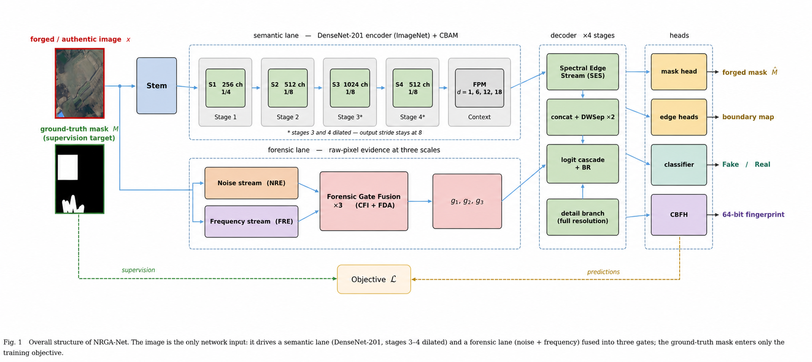

# NRGA-Net: Noise-Residual Guided Attention Network for Satellite Image Forgery Localization

Reproducibility code for the paper *"NRGA-Net: Noise-Residual Guided Attention Network for Local Manipulation Detection and Localization in Satellite Imagery."*

A single script (`src/main.py`) runs the full pipeline: it loads three benchmarks (**Fake-Vaihingen**, **Fake-LoveDA**, and **Fake-LocalDiff**), trains the dual-domain forensic network **once, jointly** across all of them, fine-tunes at higher resolution, evaluates under the FECDNet-comparable **pooled protocol**, calibrates the operating threshold, and generates all result tables and qualitative figures.

The model produces three outputs from one forward pass:

- a pixel-level **forgery mask** (residual logit cascade + boundary refinement),
- an image-level **Fake / Real decision** (agreement-based detection head),
- a 64-bit **content-bound forensic hash** (CBFH) for provenance verification.



## Datasets (in `data/`)

| Benchmark | Base imagery | Generator | Train | Test forged | Test authentic |
| --- | --- | --- | --- | --- | --- |
| Fake-Vaihingen | ISPRS Vaihingen aerial | LaMa + RePaint | 2,099 | 386 | 139 |
| Fake-LoveDA | LoveDA land-cover | LaMa + RePaint | 6,852 | 1,292 | 428 |
| Fake-LocalDiff (ours) | PRDLC-PRO + RRSIS scenes | Latent diffusion (SD-2 inpainting) | 8,000 | 800 | 800 |

Fake-Vaihingen and Fake-LoveDA are released by the FLDCF authors (Sui et al., TGRS 2024). Fake-LocalDiff is the benchmark introduced in our paper (prompt-driven latent-diffusion local replacements with byte-exact compositing). The authentic folders of each benchmark are shared between its two generator variants and are de-duplicated at load time (`cfg.DEDUPE_REALS`).

Expected folder layout under the dataset root (see `data/README.md`):

```
DATA_ROOT/
├── Fake-Vaihingen/{real,fake}/{train,val}/...
├── Fake-LoveDA/{real,fake}/{train,val}/...
└── Local_Diffusion/{real,fake,mask}/{train,val}/...
```

## How to run

```
pip install -r requirements.txt
set NRGA_DATA_ROOT=D:\path\to\DATA_ROOT     :: Windows (export on Linux/Colab)
python src/main.py
```

The script executes the numbered sections in order: environment setup, data layer, model, losses, content-prior pre-training, 256px main training (AdamW, split LRs 5e-5/5e-4, cosine annealing, EMA, NaN guards, resume), 384px boundary fine-tune, checkpoint health check, pooled evaluation, calibration, and qualitative figures. Checkpoints and CSV reports are written to `$NRGA_DATA_ROOT/NRGA-Net/`.

### Colab / Jupyter

The script also runs top-to-bottom in a notebook. Mount Drive, set `NRGA_DATA_ROOT` (or edit `BASE_DB` near the top of `src/main.py`), then:

```
%run src/main.py
```

## What maps to what in the paper

| Paper element | Code location in `src/main.py` |
| --- | --- |
| Fig. 1 (overall architecture), Table 1 | model definition (`NRGANet`) |
| Fig. 2, Sec. 3.2 (FPM, dilated DenseNet-201, stride 8) | `DenseNetEncoder`, `FPM` |
| Fig. 3, Sec. 3.3 (noise-residual encoder, Eq. 1) | `NoiseResidualEncoder` |
| Fig. 4–5, Sec. 3.4 (FRE, HFRI/LFRI, FCL, Eqs. 2–3) | `FrequencyResidualEncoder`, `FrequencyConvLayer` |
| Fig. 6, Sec. 3.5 (CFI + FDA gate fusion, Eq. 4) | `ForensicGateFusion` |
| Fig. 7, Sec. 3.6 (spectral edge stream, Eq. 5) | `SpectralEdgeStream` |
| Fig. 8–9, Sec. 3.7 (decoder, logit cascade, BR, Eq. 6) | `NRDDecoder`, `BR` |
| Fig. 10, Sec. 3.8 (agreement-based detection, Eq. 7) | detection head in `NRGANet.forward` |
| Fig. 11, Sec. 3.9 (CBFH, Eq. 8) | `CBFHBranch`, `src/cbfh_db.py` |
| Sec. 3.10 (objective, Eq. 9; distortion bank) | `NRGALoss`, `apply_distortion_bank` |
| Sec. 4 (Fake-LocalDiff) | `data/README.md`, `Local_Diffusion` folders |
| Sec. 5.1 (pooled protocol, Eq. 10) | pooled metrics in `validate()` |
| Sec. 5.2 (training config) | `Config`, training loops (256px + 384px) |
| Table 3–5 (results) | evaluation + report section (prints the tables) |
| Table 6 (calibration / selective prediction) | threshold calibration + DGT sections |
| Fig. 13–14 (qualitative) | `show_predictions_grid()` |
| Sec. 5.8 (provenance verification) | CBFH registry section, `src/cbfh_db.py` |

## Notes

- Training used a single NVIDIA RTX PRO 6000 (102 GB); the 256px stage runs with batch 8 and bf16 autocast. Lower `Config.BATCH_SIZE` and disable `DILATE_STAGE4` on smaller GPUs.
- `RESUME = True` resumes from the rolling `last` checkpoint after a dropped session; a health-check section refuses to evaluate a NaN-poisoned checkpoint.
- The CBFH provenance arm is integrated but its contrastive loss is off in the localization run (`LAMBDA_PROV = 0.0`); set it back to 0.5 to train the provenance objective.
- Random seeds are fixed for reproducibility.

## Project layout

```
NRGA-Net/
├── data/
│   └── README.md       # dataset sources and expected folder layout
├── src/
│   ├── main.py         # the full reproducibility pipeline
│   └── cbfh_db.py      # CBFH provenance registry (JSON database)
├── results/            # CSV/TXT reports (generated)
├── figures/            # paper figures
├── requirements.txt
├── LICENSE
└── README.md
```

## Citation

If you find this code or the Fake-LocalDiff benchmark useful, please cite:

```
@article{shakir2026nrganet,
  title  = {NRGA-Net: Noise-Residual Guided Attention Network for Local
            Manipulation Detection and Localization in Satellite Imagery},
  author = {Shakir, Haidar Raad and Abdul Jabar, Asmaa Sadiq},
  year   = {2026}
}
```
